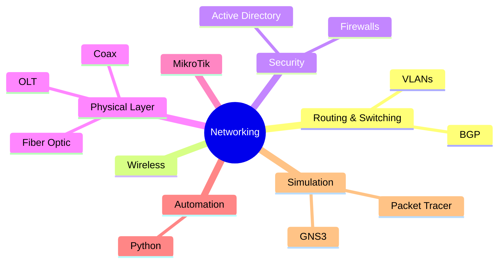

 

---

### About Me

Kosovo &nbsp;·&nbsp; CCNA-certified (Cisco)

### Tech & Tools

### Skill Map

### Contribution Snake

<picture>
  <source media="(prefers-color-scheme: dark)" srcset="https://raw.githubusercontent.com/ErdrinPervizaj-EP/ErdrinPervizaj-EP/output/github-contribution-grid-snake-dark.svg" />
  
</picture>

---

[ErdrinPervizaj-EP](https://github.com/ErdrinPervizaj-EP) · Kosovo

